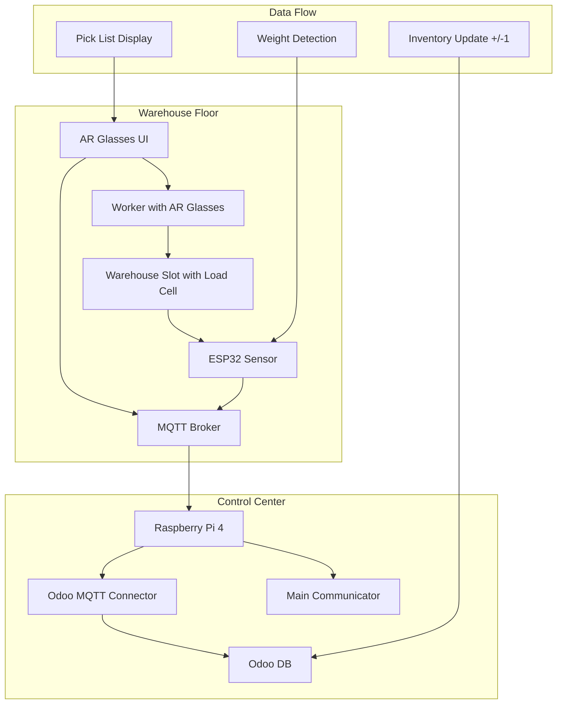
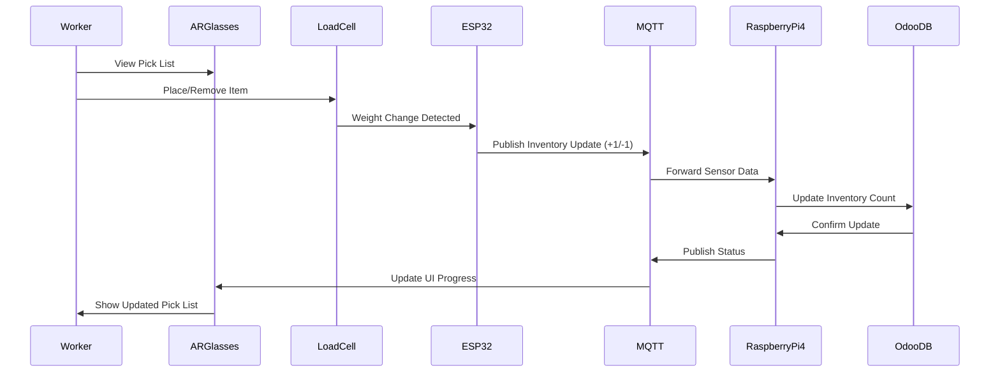

# Smart Trolley - IoT 4.0 Warehouse Automation System

A revolutionary warehouse picking solution that integrates IoT 4.0 components to accelerate product delivery times. Our system eliminates manual data entry and provides hands-free operation through AR glasses, making warehouse workers more efficient and reducing errors.

The Smart Trolley automatically tracks product weights, displays pick lists in AR glasses, and logs data directly to the ERP system - all while the worker focuses solely on loading products.

> Industry Partnership: Developed in collaboration with [ELABO company](https://www.elabo.com/) to solve real-world warehouse automation challenges

## Tech Stack

### Key Technologies
- **Hardware**: ESP32, Raspberry Pi 4, RealWear HMT-1 AR Glasses
- **Sensors**: HX711 Load Cells, Strain Gauge Sensors (1kg, 5kg, 20kg)
- **Frontend**: React.js with Redux, WebRTC for AR glasses
- **Backend**: Python (MQTT Communication, Odoo Integration)
- **Database**: Odoo ERP System
- **Communication**: MQTT Protocol for IoT 4.0 messaging
- **3D Printing**: Custom sensor housings and trolley mounts

### Technical Implementation
The integration between hardware sensors and enterprise systems was achieved through:

1. **IoT 4.0 Architecture**
   - ESP32 sensors communicate via MQTT
   - Real-time weight monitoring and data transmission
   - Seamless integration with existing warehouse infrastructure

2. **AR Interface**
   - React-based web application for AR glasses
   - Real-time pick list display
   - Hands-free operation for warehouse workers

3. **ERP Integration**
   - Automated data logging to Odoo system
   - Eliminates manual data entry errors
   - Real-time inventory tracking

## Table of Contents
1. [System Architecture](#system-architecture)
2. [Project Structure](#project-structure)
3. [Hardware Components](#hardware-components)
4. [User Interface](#user-interface)
5. [Performance Results](#performance-results)

## System Architecture

### System Overview

### Communication Flow

### Data Processing Pipeline

## Project Structure

### Hardware Components
- **ESP32 Microcontroller**: Weight sensor data collection and MQTT communication
- **Load Cells**: HX711-based strain gauge sensors for precise weight measurement
- **Raspberry Pi 4**: Central communication hub and data processing
- **RealWear HMT-1**: AR glasses for hands-free pick list display
- **3D Printed Housings**: Custom sensor mounts and trolley integration

### Software Architecture
- **ESP32 Firmware**: Arduino-based sensor control and MQTT publishing
- **React AR Interface**: Web-based application for AR glasses display
- **Python Backend**: MQTT communication and Odoo ERP integration
- **MQTT Broker**: Central message routing for IoT 4.0 communication

## Hardware Components

### ESP32 Weight Sensing System

### Load Cell Integration

### 3D Printed Sensor Housings

### Trolley Integration

## User Interface

### AR Glasses Display
The AR interface provides warehouse workers with:
- Real-time pick list display
- Product location guidance
- Weight confirmation alerts
- Progress tracking

### System Monitoring
- Real-time weight measurements
- MQTT communication status
- ERP integration confirmation
- Error handling and alerts

